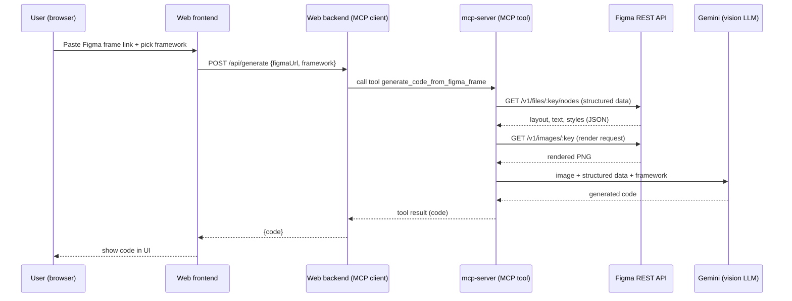

# FigmaCodegen

An app that reads a Figma design and generates code for it, by building our
own MCP (Model Context Protocol) server rather than relying on Figma's
official one (which is paid-seat-gated and locked to an allowlist of
clients like VS Code/Cursor/Claude Code).

## How it's structured

Two pieces:

1. **`mcp-server/`** — our own MCP server. Wraps Figma's open REST API
   (not the gated Dev Mode MCP server) plus a vision-capable LLM, exposed
   as one MCP tool: `generate_code_from_figma_frame`. This is the actual
   MCP-learning piece — server, tool schema, transport.
2. **`webapp/`** — a small web app (Go backend as an MCP *client* + a
   React frontend) so people can paste a Figma link into a browser UI
   instead of using an MCP-aware editor.

```
FigmaCodegen/
  mcp-server/
    cmd/server/main.go           — entrypoint, registers the tool, runs over stdio
    cmd/testclient/main.go       — minimal CLI MCP client, for testing without the Node-based Inspector
    internal/config/             — .env (secrets) + config.json (settings) split
    internal/figma/              — Figma REST client (node data + rendered image)
    internal/codegen/            — pluggable CodeGenerator interface + Gemini impl
    config.json
    .env.example
  webapp/
    backend/
      cmd/server/main.go         — MCP client; connects to mcp-server, exposes POST /api/generate
      internal/config/
      config.json
      .env.example
    frontend/                    — React/Vite UI: paste a link, pick a framework, see the code
```

## Flow



You can also exercise everything from "call tool" onward directly, without
the top two rows, using `mcp-server/testclient` (see **How to run** below).

## mcp-server: how it works

Given a Figma frame link (e.g. `https://www.figma.com/design/ABC123/My-File?node-id=1-23`),
the `generate_code_from_figma_frame` tool:

1. Parses the file key + node ID out of the URL.
2. Fetches the node's structured data (`GET /v1/files/:key/nodes`) — layout,
   text, styles.
3. Fetches a rendered PNG of the frame (`GET /v1/images/:key`).
4. Sends both (image + structured data) to Gemini, asking for code in the
   requested framework (default: React).
5. Returns the generated code as the tool's result.

Auth note: Figma's REST API takes personal access tokens via a custom
`X-Figma-Token` header — **not** `Authorization: Bearer` (that's for OAuth
tokens only, and silently 403s a PAT).

### Config

Same split as commit-notification-app, for the same reason — secrets never
belong in a committed file:

| File | Contents |
|---|---|
| `.env` (gitignored, copy from `.env.example`) | `FIGMA_TOKEN`, `GEMINI_API_KEY` |
| `config.json` (committed) | `geminiModel`, `defaultFramework`, `maxImageBytes` |

### LLM provider

Currently Gemini (`gemini-3.8-flash`, set in `mcp-server/config.json`) —
picked for its free tier with real vision support, needed since this task
requires the model to actually look at the rendered frame. `CodeGenerator`
is an interface (`internal/codegen/codegen.go`), so other vision-capable
providers (Claude, Groq, etc.) can be added the same way `groq`/`claude`
were pluggable in commit-notification-app.

## webapp

- Backend: Go, acts as the MCP *client* — connects to `mcp-server` and
  calls its tool, exposes one REST endpoint for the frontend
  (`POST /api/generate { figmaUrl, framework }`).
- Frontend: React/Vite — paste a link, pick a framework, see the generated
  code.

No auth/DB needed for this — it's a personal learning project, not a
multi-user product.

## How to run

Three pieces. `mcp-server` doesn't need to be run directly — the webapp
backend spawns it as a subprocess — but it does need to be built first.

**1. Build the MCP server**

```bash
cd mcp-server
cp .env.example .env   # fill in FIGMA_TOKEN and GEMINI_API_KEY
go build -o server ./cmd/server
```

**2. Run the web backend** (in its own terminal tab)

```bash
cd webapp/backend
cp .env.example .env   # PORT and FRONTEND_URL - defaults usually fine
go build -o backend-server ./cmd/server
./backend-server
```

It should print something like:

```
webapp backend listening on :8081 (mcp server: ../../mcp-server/server, frontend: http://localhost:5174)
```

**3. Run the frontend** (in a second terminal tab)

```bash
cd webapp/frontend
npm install   # first time only
npm run dev
```

It prints a local URL (Vite's default is `http://localhost:5173`, but it
picks the next free port if that's taken — e.g. `5174`).

**4. Open it** — go to whatever URL the frontend printed, paste a Figma
frame link (use "Copy link to selection" in Figma so it includes a
`node-id`), pick a framework, click **Generate code**.

⚠️ If Vite prints a port other than what's in `webapp/backend/.env`'s
`FRONTEND_URL`, update that value and restart the backend - a mismatch
here causes CORS errors in the browser.

### Testing the MCP server on its own

No need to spin up the whole web app to test `mcp-server` in isolation.
Use the bundled CLI test client instead of the Node-based MCP Inspector
(which needs a newer Node version than this machine has):

```bash
cd mcp-server
go build -o testclient ./cmd/testclient
./testclient -url "<figma frame link>"            # defaults to react
./testclient -url "<figma frame link>" -framework html
```

## Do we need an "agent" here?

No, not for the current one-tool flow — there's only one tool and no
decision to make about which one to call or in what order, so the web
backend is a plain MCP client, not an agent. An agent would earn its keep
if this grows into several smaller tools (e.g. `list_frames`,
`get_frame_image`, `generate_code`) with an LLM deciding which to call and
when — a possible stretch goal, not part of the MVP.
